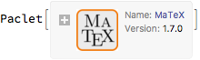
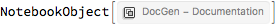
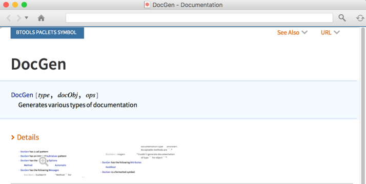
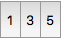
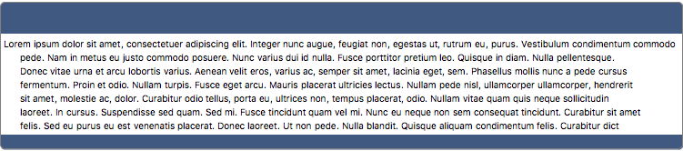
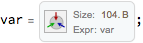
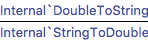
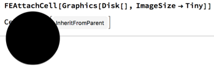
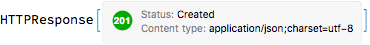

<a id="btools" style="width:0;height:0;margin:0;padding:0;">&zwnj;</a>

# BTools

[](https://github.com/b3m2a1/mathematica-BTools/releases/latest)   [](https://github.com/b3m2a1/mathematica-BTools/PacletInfo.m)   [](https://opensource.org/licenses/MIT)

The BTools application is a multi-use Mathematica application, largely devoted to simplifying the development process. The application has an autoloader primary file that exposed package-scoped helper functions and loads all of the packages in the  [Packages](Packages)  directory into the main context.

---

<a id="installation" style="width:0;height:0;margin:0;padding:0;">&zwnj;</a>

# Installation

The easiest way to install these packages is using a paclet server installation:

```mathematica
 PacletInstall[
  "BTools",
  "Site"->
    "http://www.wolframcloud.com/objects/b3m2a1.paclets/PacletServer"
  ]
```

If you've already installed it you can update using:

```mathematica
 PacletUpdate[
  "BTools",
  "Site"->
    "http://www.wolframcloud.com/objects/b3m2a1.paclets/PacletServer"
  ]
```

Alternately you can download this repo as a ZIP file and put extract it in  ```$UserBaseDirectory/Applications```

---

<a id="package-listing" style="width:0;height:0;margin:0;padding:0;">&zwnj;</a>

# Package Listing

BTools has been refactored. Functionality is now divided into different contexts for ease of use.

<a id="paclets" style="width:0;height:0;margin:0;padding:0;">&zwnj;</a>

## Paclets

The paclets context handles the paclet development functionality

### Packages

* [AppBuilder](Packages/AppBuilder.m)

* [PacletTools](Packages/PacletTools.m)

* [DocGen](Packages/DocGen.m)

### Palettes

* [AppManager](FrontEnd/Palettes/AppManager.nb)

* [Paclet Server Manager](FrontEnd/Palettes/PacletServerManager.nb)

### Stylesheets

* [SyntaxHiglighting](FrontEnd/StyleSheets/BTools/SyntaxHiglighting.nb)

* [CodePackage](FrontEnd/StyleSheets/BTools/CodePackage.nb)

* [CodeNotebook](FrontEnd/StyleSheets/BTools/CodePackage.nb)

* [DocGen](FrontEnd/StyleSheets/BTools/DocGen.nb)

### Description

The  [AppBuilder](Packages/AppBuilder.m)  package supports building Mathematica Applications. It supports formatting applications, adding and finding application content, as well as creating sub-applications from current application content.

It integrates with the rest of  BTools to allow paclet deployment, documentation building, publishing to GitHub, etc. This functionality is then encapsulated in the  [AppManager](FrontEnd/Palettes/AppManager.nb)  palette for ease of use

[PacletTools](Packages/PacletTools.m)  makes it easy to create, distribute, and work with paclets. It provides automatic creation and updating of PacletInfo.m files, paclet packing and upload, paclet installation from a non-paclet source, etc. It also supports a different paclet front-end format for easier inspection.

<a id="examples" style="width:0;height:0;margin:0;padding:0;">&zwnj;</a>

## Examples

Load the package:

```mathematica
 <<BTools`Paclets`
```

Create a new application

```mathematica
 $AppDirectoryRoot = $TemporaryDirectory; 
 AppConfigure["NewApp"]
```

    (*Out:*)
    
    "/private/var/folders/9t/tqc70b7d61v753jkdbjkvd640000gp/T/Applications/NewApp"

Install a paclet from GitHub:

```mathematica
 PacletInstallPaclet@"https://github.com/szhorvat/MaTex"
```

    (*Out:*)
    


Autogenerate documentation:

```mathematica
 DocGen[DocGen]
```

    (*Out:*)
    




More info can be found in the  [Paclet examples](project/examples/Paclets.md) .

---

<a id="frontend" style="width:0;height:0;margin:0;padding:0;">&zwnj;</a>

## FrontEnd

### Packages

* [StylesheetEdits](Packages/StylesheetEdits.m)

* [IndentableCells](Packages/IndentableCells.m)

* [SyntaxColoring](Packages/SyntaxColoring.m)

* [NotebookTools](Packages/NotebookTools.m)

* [FormattingTools](Packages/FormattingTools.m)

### Stylesheets

* [SyntaxHighlighting](FrontEnd/StyleSheets/BTools/SyntaxHighlighting.nb)

### Description

[StylesheetEdits.m](Packages/StylesheetEdits.m)  exposes a collection of functions to more easily build and edit stylesheets programmatically and has been used in make all of the stylesheets in the application (any many more).  [IndentableCells.m](Packages/IdentableCells.m)  provides a set of functions for block indenting or dedenting a notebook selection and is used in the  [CodePackage](FrontEnd/StyleSheets/BTools/CodePackage.nb)  stylesheet.  [SyntaxColoring.m](Packages/SyntaxColoring.m)  provides convenient access to the internal syntax coloring styles and options and is used in the  [SyntaxHighlighting](FrontEnd/StyleSheets/BTools/SyntaxHighlighting.nb)  and  [CodePackage](FrontEnd/StyleSheets/BTools/CodePackage.nb)  stylesheets.  [NotebookTools.m](Packages/NotebookTools.m)  provides notebook and box-language convenience functions, such as a compressed blob for storing chunks of data in a notebook, or a function to add newlines to iterables. Finally,  [FormattingTools.m](Packages/FormattingTools.m)  provides a collection of GUI objects for making attractive interfaces.

### Examples:

* ```StyleSheetEdit```  allows one to very easily edit stylesheets, even without opening the stylesheet. 

* ```MakeIndentable```  makes a  ```Cell```  or  ```Notebook```  block-indentable

* ```GradientButton```  and friends provide a collection of attractive interface elements

```mathematica
 GradientButtonBar[{1:>2, 3:>4, 5:>6}, FrameMargins->5]
```

    (*Out:*)
    


* ```NinePatchCreate```  turns anything into a nine-patch to be used as an  ```Appearance``` . It's used, for example, in  ```NinePatchNameTag```  to make a nice name-tag appearances.

```mathematica
 Panel[
  StringTake[ExampleData[{"Text", "LoremIpsum"}], 1000],
  Appearance->
  NinePatchNameTag[
    {Background->Hue[.6,.5,.5], RoundingRadius->5},
    {Background->White},
    {Background->Hue[.6,.5,.5], RoundingRadius->5}
    ]
  ]
```

    (*Out:*)
    


* ```StoreExpression```  generates a compressed form of a variable (only  ```OwnValues```  are currently supported) and writes a cell to restore that variable:

```mathematica
 var={1,2,3}; 
 StoreExpression@var
```

    (*Out:*)
    


More info can be found in the  [FrontEnd examples](project/examples/FrontEnd.md) .

---

<a id="web" style="width:0;height:0;margin:0;padding:0;">&zwnj;</a>

## Web

### Packages

* [SiteBuilder](Packages/SiteBuilder.m)

* [MarkdownParsers](Packages/MarkdownParsers.m)

* [NotebookToMarkdown](Packages/NotebookToMarkdown.m)

* [PacletServerBuilder](Packages/PacletServerBuilder.m)

* [PelicanTools](Packages/PelicanTools.m)

### Stylesheets

* [MarkdownNotebook](FrontEnd/StyleSheets/BTools/MarkdownNotebook.nb)

* [PelicanMarkdown](FrontEnd/StyleSheets/BTools/PelicanMarkdown.nb)

### Palettes

* [Site Builder](FrontEnd/Palettes/SiteBuilder.nb)

* [Paclet Server Manager](FrontEnd/Palettes/PacletServerManager.nb)

### Description

[SiteBuilder.m](Packages/SiteBuilder.m)  is a Mathematica rewrite of the pelican static site generator with convenience functions for deploying to the cloud.  [MarkdownParsers.m](Packages/MarkdownParsers.m)  provides functions for parsing markdown text to  [Symbolic XML](http://reference.wolfram.com/language/XML/tutorial/RepresentingXML.html#1695) .  [NotebookToMarkdown.m](Packages/NotebookToMarkdown.m)  goes the other way, exporting a notebook to markdown. The [ ](http://reference.wolfram.com/language/XML/tutorial/RepresentingXML.html#1695) [PacletServerBuilder](Packages/PacletServerBuilder.m)  is then a layer on top of this to make 

### Examples

[This](https://www.wolframcloud.com/objects/b3m2a1/home/main.html)  is a site built via the pelican link in  [PelicanTools](Packages/PelicanTools.m)  and  [this](https://www.wolframcloud.com/objects/b3m2a1.paclets/PacletServer/main.html)  is a site built with the  [PacletServerBuilder](Packages/PacletServerBuilder.m) . Both implicitly use the  ```NotebookMarkdownSave```  function in  [MarkdownToNotebook](Packages/MarkdownToNotebook.m)  which gets called automatically with the  [MarkdownNotebook](FrontEnd/StyleSheets/BTools/MarkdownNotebook.nb)  stylesheet, which also provides convenient style configurations and key-bindings to make notebooks that are processable by  ```NotebookMarkdownSave``` .  [SiteBuilder.m](Packages/SiteBuilder.m)  also makes use of the  ```MarkdownToXML```  function in  [MarkdownParsers.m](Packages/MarkdownParsers.m)  for filling out its templates.

These have been pretty well explored on the web, for instance,  [here](https://www.wolframcloud.com/objects/b3m2a1/home/building-websites-with-mathematica.html#main-content) ,  [here](https://www.wolframcloud.com/objects/b3m2a1/home/building-websites-with-mathematica-part-2.html#main-content) , and  [here](http://community.wolfram.com/groups/-/m/t/1251138#_19_message_1253177) . More examples are coming when I have time.

---

### Utilities

* [DocFind](Packages/DocFind.m)

* [ScrapeTools](Packages/ScrapeTools.m)

* [ContextTools](Packages/ContextTools.m)

* [FETools](Packages/FETools.m)

* [TRTools](Packages/TRTools.m)

### Description

[FETools.m](Packages/FETools.m)  provides access to a wide array of useful front-end functionality, largely by creating top-level functions for various  [front-end packets](https://mathematica.stackexchange.com/q/13451/38205) .  [TRTools.m](Packages/TRTools.m)  exposes helper functions for working with the front-end TextResource system which is useful for modifying the system.  [DocFind](Packages/DocFind.m)  implements a set of nice documentation search interfaces and  [ScrapeTools](Packages/ScrapeTools.m)  provides a bunch of functions for scraping formation from the system.

### Examples:

Search for functions with  ```"Do"```  in them anywhere in a context starting with  ```"Int"```

```mathematica
 DocFind["Do", "Int*", Select->"Function"]
```

    (*Out:*)
    


Search a directory for a regex pattern:

```mathematica
 GrepDirectory[FileNameJoin@{$InstallationDirectory, "AddOns"}, "EntityValue"]
```

    (*Out:*)
    
    {"/Applications/Mathematica.app/Contents/AddOns/Applications/StandardOceanData/Kernel/StandardOceanData.m","/Applications/Mathematica.app/Contents/AddOns/Applications/DataDropClient/Kernel/DataDropClientAdd.m","/Applications/Mathematica.app/Contents/AddOns/Applications/EntityFramework/Resources/FunctionalFrequency/specialArgFunctions.tr","/Applications/Mathematica.app/Contents/AddOns/Applications/AstronomyConvenienceFunctions/Kernel/AstronomyConvenienceFunctions.m"}

```FEAddAutocompletions```  provides a wrapper for adding autocompletions to a function:

```mathematica
 f[x:"A"|"B"|"C",b_Notebook]:=x; 
 FEAddAutocompletions[f,
  {
    {"A","B","C"},
    Notebook
    }
  ];
```

    (*Out:*)
    


Add an attached cell to the evaluation cell:

```mathematica
 FEAttachCell[Graphics[Disk[],ImageSize->Tiny]]
```

    (*Out:*)
    


---

<a id="frameworks" style="width:0;height:0;margin:0;padding:0;">&zwnj;</a>

# Frameworks

### Packages

* [CustomServiceConnection](Packages/CustomServiceConnection.m)

* [CuratedData](Packages/CuratedData.m)

### Description

These two packages provide a single function each of which fills a paclet from a template. They also provide template notebooks for building such paclets.  [CustomServiceConnection](Packages/CustomServiceConnection.m)  provides a function for making a new  ```ServiceObject```  and  [CuratedData](Packages/CuratedData.m)  provides a function for building a collection of curated data paclets which function like  ```ChemicalData``` .

More info about them can be found  [here](https://www.wolframcloud.com/objects/b3m2a1/home/serviceconnections---mathematica-on-the-web.html#main-content)  and  [here](https://mathematica.stackexchange.com/a/146221/38205) .

---

<a id="external" style="width:0;height:0;margin:0;padding:0;">&zwnj;</a>

# External

### Packages

* [GitConnection](Packages/GitConnection.m)

* [GoogleDrive](Packages/GoogleDrive.m)

* [PyTools](Packages/PyTools.m)

* [ProcessTools](Packages/ProcessTools.m)

### Description

[GitConnection](Packages/GitConnection.m)  has three primary functions,  ```Git``` ,  ```GitHub``` ,  and  ```SVN```  which act as wrapper functions to their respective services.  [PyTools](Packages/PyTools.m)  provides a two wrappers for useful python functionality,  [virtualenv](https://virtualenv.pypa.io/en/stable/)  and  [SimpleHTTPServer](https://docs.python.org/2/library/simplehttpserver.html)  and may support more functionality in the future.  [ProcessTools](Packages/ProcessTools.m)  just provides a few wrappers on the  ```RunProcess```  /  ```StartProcess```  system.

### Examples

Load the package

```mathematica
 <<BTools`External`
```

Create a repository in GitHub

```mathematica
 GitHub["Create", "test-repo",
  "Description"->"a test repo",
  "GitHubImport"->False
  ]
```

    (*Out:*)
    


More info can be found in the  [External examples](project/examples/External.md) .