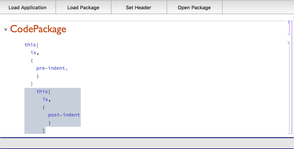
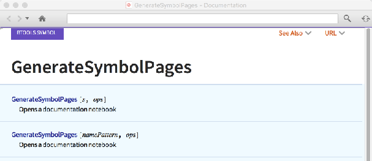
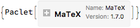
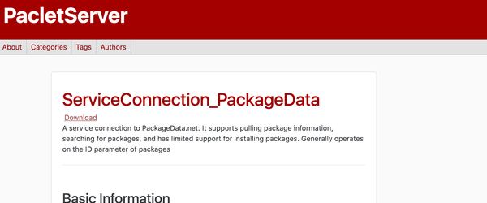
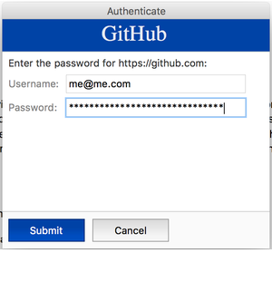

<a id="btools" style="width:0;height:0;margin:0;padding:0;">&zwnj;</a>

# BTools

The BTools application is a multi-use Mathematica application, largely devoted to simplifying the development process. The application has an autoloader primary file that exposed package-scoped helper functions and loads all of the packages in the  [Packages](Packages)  directory into the main context.

Sample documentation lives  [here](https://www.wolframcloud.com/objects/b3m2a1.docs/reference/BTools/guide/BTools.html)  but it should be noted that this is auto-built and hence essentially example-less documentation. I am, however, responsive via email and can provide examples and better-written documentation for functions and packages upon request.

If you want me to spin off subpackages which only contain some portion of this functionality contact me and I can easily do that too.

---

<a id="package-listing" style="width:0;height:0;margin:0;padding:0;">&zwnj;</a>

# Package Listing

<a id="application-development" style="width:0;height:0;margin:0;padding:0;">&zwnj;</a>

## Application Development

### Packages

* [AppBuilder](Packages/AppBuilder.m)

### Palettes

* [AppManager](FrontEnd/Palettes/AppManager.nb)

### Stylesheets

* [CodePackage](FrontEnd/StyleSheets/BTools/CodePackage.nb)

### Description

The AppBuilder package supports building Mathematica Applications. It supports formatting applications, adding and finding application content, as well as creating sub-applications from current application content.

It integrates with the rest of the BTools package to allow paclet deployment, documentation building, publishing to GitHub, etc. This functionality is then encapsulated in the  [AppManager](FrontEnd/Palettes/AppManager.nb)  palette for ease of use

On the development side, the  [CodePackage](FrontEnd/StyleSheets/BTools/CodePackage.nb)  stylesheet provides a convenient stylesheet for developing packages, interfacing with other packages to allow more customizable syntax coloring, block indentation, and package markdown in the automatically generate package.

	(*Out:*)
	
 

---

<a id="documentation-building" style="width:0;height:0;margin:0;padding:0;">&zwnj;</a>

## Documentation Building

### Packages

* [DocGen](Packages/DocGen.m)

### Palettes

* [DocGen](FrontEnd/StyleSheets/BTools/DocGen.nb)

### Description

[DocGen.m](Packages/DocGen.m)  provides functionality for creating documentation automatically or via templates. The built documentation notebooks can also be exported to HTML and used on the web, or simply indexed and used in the documentation center. The  [DocGen](FrontEnd/StyleSheets/BTools/DocGen.nb)  stylesheet makes building documentation templates that work with DocGen.m easier.

### Examples

```GenerateSymbolPages```  builds a symbol page from a notebook or automatically generates symbol pages from a symbol or set of symbols.  ```FEScreenShot```  is a function from  [FETools.m](Packages/FETools.m)  that uses GUIKit to screenshot a notebook.

	img = FEScreenShot@GenerateSymbolPages@GenerateSymbolPages;
	ImageTake[img, 250]

	(*Out:*)
	
 

---

<a id="paclet-distribution" style="width:0;height:0;margin:0;padding:0;">&zwnj;</a>

## Paclet Distribution

### Packages

* [PacletTools](Packages/PacletTools.m)

* [PacletServerBuilder](Packages/PacletServerBuilder.m)

### Packages

[PacletTools.m](Packages/PacletTools.m)  supports building and distribution paclets. It provides automatic creation and updating of PacletInfo.m files, paclet packing and upload, paclet installation from a non-paclet source, etc. It also supports a different paclet front-end format for easier inspection.

### Examples

Install a paclet from a non-standard source:

	PacletInstallPaclet@"https://github.com/szhorvat/MaTex"

	(*Out:*)
	
 

Add a paclet to the default paclet server and deploy it:

	PacletServerAdd["ServiceConnection_PackageData"];
	PacletServerBuild["AutoDeploy" -> True];

	(*Out:*)
	
 

---

<a id="notebook-aides" style="width:0;height:0;margin:0;padding:0;">&zwnj;</a>

## Notebook Aides

### Packages

* [StylesheetEdits](Packages/StylesheetEdits.m)

* [IndentableCells](Packages/IndentableCells.m)

* [SyntaxColoring](Packages/SyntaxColoring.m)

* [NotebookTools](Packages/NotebookTools.m)

* [FormattingTools](Packages/FormattingTools.m)

### Stylesheets

* [SyntaxHighlighting](FrontEnd/StyleSheets/BTools/SyntaxHighlighting.nb)

### Description

[StylesheetEdits.m](Packages/StylesheetEdits.m)  exposes a collection of functions to more easily build and edit stylesheets programmatically and has been used in make all of the stylesheets in the application (any many more).  [IndentableCells.m](Packages/IdentableCells.m)  provides a set of functions for block indenting or dedenting a notebook selection and is used in the  [CodePackage](FrontEnd/StyleSheets/BTools/CodePackage.nb)  stylesheet.  [SyntaxColoring.m](Packages/SyntaxColoring.m)  provides convenient access to the internal syntax coloring styles and options and is used in the  [SyntaxHighlighting](FrontEnd/StyleSheets/BTools/SyntaxHighlighting.nb)  and  [CodePackage](FrontEnd/StyleSheets/BTools/CodePackage.nb)  stylesheets.  [NotebookTools.m](Packages/NotebookTools.m)  provides notebook and box-language convenience functions, such as a compressed blob for storing chunks of data in a notebook, or a function to add newlines to iterables. Finally,  [FormattingTools.m](Packages/FormattingTools.m)  provides a collection of GUI objects for making attractive interfaces.

### Examples:

```StoreExpression```  generates a compressed form of a variable (only  ```OwnValues```  are currently supported) and writes a cell to restore that variable:

	var = {1, 2, 3};
	StoreExpression@var

	(*Out:*)
	
 

---

<a id="frontend-tools" style="width:0;height:0;margin:0;padding:0;">&zwnj;</a>

## Front-End Tools

### Packages

* [FETools](Packages/FETools.m)

* [TRTools](Packages/TRTools.m)

### Description

[FETools.m](Packages/FETools.m)  provides access to a wide array of useful front-end functionality, largely by creating top-level functions for various  [front-end packets](https://mathematica.stackexchange.com/q/13451/38205) .  [TRTools.m](Packages/TRTools.m)  exposes helper functions for working with the front-end TextResource system which is useful for modifying the system.

### Examples:

```FEAddAutocompletions```  provides a wrapper for adding autocompletions to a function:

	f[x : "A" | "B" | "C", b_Notebook] := x;
	FEAddAutocompletions[f,
	   {
	     {"A", "B", "C"},
	     Notebook
	     }
	   ];

	(*Out:*)
	
 

Add an attached cell to the evaluation cell:

	FEAttachCell[Graphics[Disk[], ImageSize -> Tiny]]

	(*Out:*)
	
 

---

<a id="authentication-tools" style="width:0;height:0;margin:0;padding:0;">&zwnj;</a>

# Authentication Tools

### Packages

* [AuthDialogs](Packages/AuthDialogs.m)

* [EncodedCache](Packages/EncodedCache.m)

### Description

[AuthDialogs.m](Packages/AuthDialogs.m)  provides a set of functions for creating attractive authentication dialogs.  [EncodedCache.m](Packages/EncodedCache.m)  provides and interface for creating password-encoded key-value caches. It also provides a  ```$KeyChain```  cache which uses the authentication dialogs to ask for and save log-in credentials which may be used later. This is particularly useful for Wolfram Cloud accounts, and a special function for connection via the  ```$KeyChain```  is provided.

### Examples

Create a simple authentication dialog:

	AuthenticationDialog["GitHub", "https://github.com"]

	(*Out:*)
	
 
	<|"https://github.com" -> {"me@me.com", 
	   "me password's on the internet!"}|>

Switch between cloud accounts:

	KeyChainConnect["PacletsAccount"]

	(*Out:*)
	
	"b3m2a1.paclets@gmail.com"

<a id="web-tools" style="width:0;height:0;margin:0;padding:0;">&zwnj;</a>

# Web Tools

### Packages

* [WebTemplating](Packages/WebTemplating.m)

* [SiteBuilder](Packages/SiteBuilder.m)

* [MarkdownParsers](Packages/MarkdownParsers.m)

### Stylesheets

* [MarkdownNotebook](FrontEnd/StyleSheets/BTools/MarkdownNotebook.nb)

* [HTMLTemplating](FrontEnd/StyleSheets/BTools/HTMLTemplating.nb)

* [PelicanMarkdown](FrontEnd/StyleSheets/BTools/PelicanMarkdown.nb)

### Description

[WebTemplating.m](Packages/WebTemplating.m)  works with the  [HTMLTemplating](FrontEnd/StyleSheets/BTools/HTMLTemplating.nb)  stylesheet to allow one to write HTML as cells in a notebook (with appropriate conversions of options, etc.) as well as providing interface functions to the pelican static site generator.  [SiteBuilder.m](Packages/SiteBuilder.m)  is a Mathematica rewrite of the pelican static site generator with convenience functions for deploying to the cloud. The  [MarkdownParsers.m](Packages/MarkdownParsers.m)  package provides functions for both parsing markdown text to  [Symbolic XML](http://reference.wolfram.com/language/XML/tutorial/RepresentingXML.html#1695)  and exporting a notebook to markdown.

### Examples

[This](https://www.wolframcloud.com/objects/b3m2a1/home/main.html)  is a site built via the pelican link in  [WebTemplating.m](Packages/WebTemplating.m)  and  [this](https://www.wolframcloud.com/objects/b3m2a1.paclets/PacletServer/main.html)  is a site built directly with  [SiteBuilder.m](Packages/SiteBuilder.m) . Both implicitly use the  ```NotebookMarkdownSave```  function in  [MarkdownParsers.m](Packages/MarkdownParsers.m)  which gets called automatically with the  [MarkdownNotebook](FrontEnd/StyleSheets/BTools/MarkdownNotebook.nb)  stylesheet, which also provides convenient style configurations and key-bindings to make notebooks that are processable by  ```NotebookMarkdownSave``` .  [SiteBuilder.m](Packages/SiteBuilder.m)  also makes use of the  ```MarkdownToXML```  function in  [MarkdownParsers.m](Packages/MarkdownParsers.m)  for filling out its templates.

<a id="paclet-templates" style="width:0;height:0;margin:0;padding:0;">&zwnj;</a>

# Paclet Templates

### Packages

* [CustomServiceConnection](Packages/CustomServiceConnection.m)

* [CuratedData](Packages/CuratedData.m)

### Description

These two packages provide a single function each of which fills a paclet from a template. They also provide template notebooks for building such paclets.  [CustomServiceConnection](Packages/CustomServiceConnection.m)  provides a function for making a new  ```ServiceObject```  and  [CuratedData](Packages/CuratedData.m)  provides a function for building a collection of curated data paclets which function like  ```ChemicalData``` .

<a id="external-services" style="width:0;height:0;margin:0;padding:0;">&zwnj;</a>

# External Services

### Packages

* [GitConnection](Packages/GitConnection.m)

* [PyTools](Packages/PyTools.m)

* [ProcessTools](Packages/ProcessTools.m)

### Description

[GitConnection](Packages/GitConnection.m)  has three primary functions,  ```Git``` ,  ```GitHub``` ,  and  ```SVN```  which act as wrapper functions to their respective services.  [PyTools](Packages/PyTools.m)  provides a two wrappers for useful python functionality,  [virtualenv](https://virtualenv.pypa.io/en/stable/)  and  [SimpleHTTPServer](https://docs.python.org/2/library/simplehttpserver.html)  and may support more functionality in the future.  [ProcessTools](Packages/ProcessTools.m)  just provides a few wrappers on the  ```RunProcess```  /  ```StartProcess```  system.