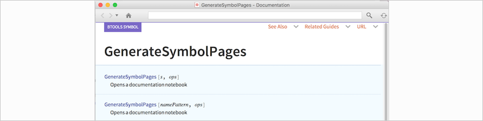
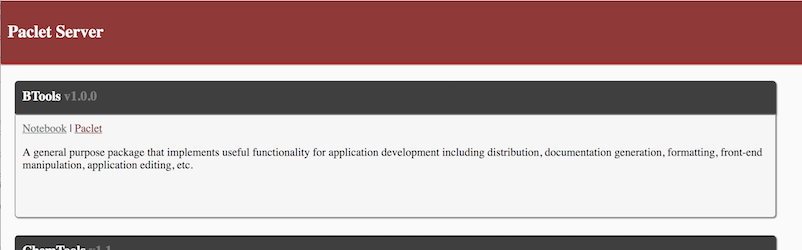
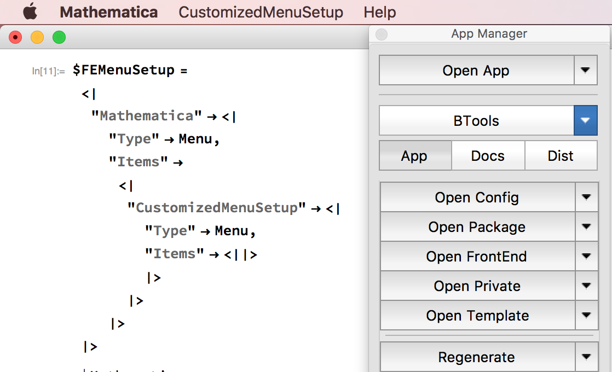

## BTools Mathematica Application

The BTools application is a multi-use mathematica application, largely devoted to simplifying the development process.

It supports a few major pieces of functionality:

###Application Development:

The AppBuilder package supports building Mathematica Applications. It supports formatting applications, adding and finding application content, as well as creating sub-applications from current application content.

It integrates with the rest of the BTools package to allow paclet deployment, documentation building, publishing to GitHub, etc.

This functionality is then all encapsulated in an easy-to-use palette

###Notebook Aides:

The StylesheetsEdits packages implements simplified stylesheet editing, including editing the hidden private stylesheet notebook for a given notebook. This can be useful for editing all styles in a given notebook without ever opening its stylesheet. The package will attempt to detect whether the current edit notebook is a stylesheet notebook or not, and act on the notebook itself or its stylesheet, respectively.

The IndentableCells implements batch indenting and dedenting in cells and converting \[IndentingNewLine] blocks to the appropriate tab-spaced blocks and vice-versa. This functionality is built into the CodePackage and CodeNotebook stylesheets.

###Documentation Building:

The DocGen package supports documentation generation, both automatically and via templates. Integration with the Wolfram DocumentationTools is upcoming.

###Paclet Deployment:

The PacletTools package supports creating paclets and deploying paclets, both locally and to the Wolfram Cloud.

It also supports gathering paclet information and automatic paclet information generation from a directory.

More paclet server integrations are coming, but there is currently functionality for deploying a paclet server landing page

###Front-End Integrations:

The FormattingTools package provides a collection of formatted front end objects that can be used for interface customization, the FETools package supplies tools for manipulating and inspecting the front end, and the TRTools provides ways to work with the built-in TextResource system, which simplifies menu customizations among many other things

###Web Integrations:

CuratedData, CustomServiceConnection, GitConnection, GoogleDrive, StackExchangeAPI

###Misc Tools:

