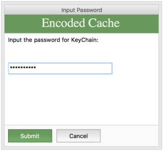
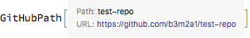
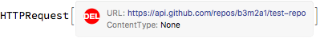
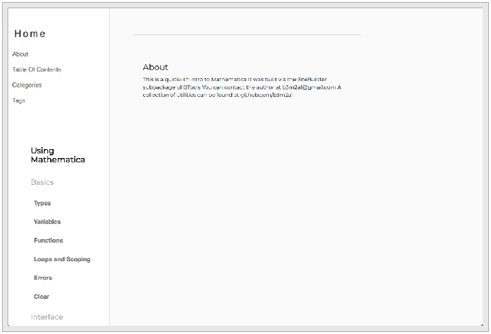

<a id="external-examples" style="width:0;height:0;margin:0;padding:0;">&zwnj;</a>

# External Examples

Load the package

```mathematica
 <<BTools`External`
```

<a id="working-with-github" style="width:0;height:0;margin:0;padding:0;">&zwnj;</a>

## Working with GitHub

You'll be prompted to put your info into an encoded keychain BTools implements:



Get the path to the repo

```mathematica
 GitHub["Path", "test-repo"]
```

	(*Out:*)
	


Clone the repo:

```mathematica
 GitHub["Clone", "test-repo", FileNameJoin@{$TemporaryDirectory, "test-repo"},
 OverwriteTarget->True
 ]
```

	(*Out:*)
	
	"/private/var/folders/9t/tqc70b7d61v753jkdbjkvd640000gp/T/test-repo"

Delete the repo

```mathematica
 GitHub["Delete", "test-repo",
 "GitHubImport"->False
 ]
```

	(*Out:*)
	


<a id="working-with-python" style="width:0;height:0;margin:0;padding:0;">&zwnj;</a>

## Working with Python

Start a  [SimpleHTTPServer](https://docs.python.org/2/library/simplehttpserver.html)  and open the landing page:

