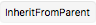
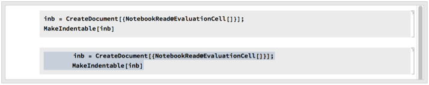
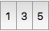
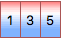
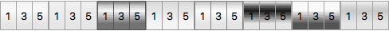
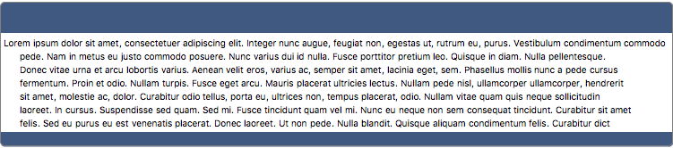
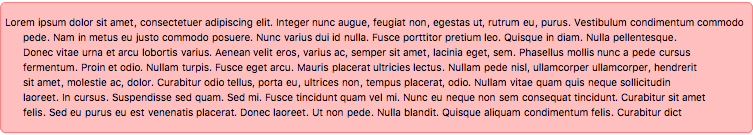
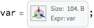

Load the package

```mathematica
 <<BTools`FrontEnd`
```

<a id="stylesheets" style="width:0;height:0;margin:0;padding:0;">&zwnj;</a>

## StyleSheets

```StyleSheetEdit```  allows one to very easily edit stylesheets, even without opening the stylesheet. For example, we can make a notebook and edit its stylesheet programmatically:

```mathematica
 snb = CreateDocument[{Cell["Title", "Title"], Cell["A block of text...", "Text"]}]; 
 StyleSheetEdit[snb, 
 "Text",
 {
  FontColor->Red,
  FontFamily->"Helvetica"
  },
 "MakeCell"->True
 ]
```


Then we can find the style cell where this is implemented:

```mathematica
 StyleSheetCells[snb, "Text"]
```

	(*Out:*)
	
	{CellObject[]}

On top of this we have:

* ```StyleSheetNew```  - makes new style cells

* ```StyleSheetEditAliases```  - edits the  ```InputAliases```  for a given notebook

* ```StyleSheetEditAutoReplacements```  - edits the  ```InputAutoReplacements```  for a given notebook

* ```StyleSheetEditEvents```  - edits the  ```CellEventActions```  or  ```NotebookEventActions```  for a given cell/notebook

* ```StyleSheetEditTaggingRules```  - edits the  ```TaggingRules```  for a given notebook

<a id="block-indentation" style="width:0;height:0;margin:0;padding:0;">&zwnj;</a>

## Block Indentation

```MakeIndentable```  makes a  ```Cell```  or  ```Notebook```  block-indentable

```mathematica
 inb = CreateDocument[{NotebookRead@EvaluationCell[]}]; 
 MakeIndentable[inb]
```



The indentation methods themselves can be called with  ```IndentationEvent```  or  ```BatchIndentationEvent``` . The latter applies an indentation event to the entire notebook, which can be useful with the  ```"Replace"```  event for turning  ```"∖[IndentingNewLine]"```  indented into  ```"\n"```  indented cells

<a id="formatting-elements" style="width:0;height:0;margin:0;padding:0;">&zwnj;</a>

## Formatting elements

[FormattingTools](Packages/FormattingTools.m)  implements a number of useful formatting elements. Chief among these are the  ```Gradient*```  family of elements, starting with  ```GradientButton``` . For example, we can make a button bar:

```mathematica
 GradientButtonBar[{1:>2, 3:>4, 5:>6}, FrameMargins->5]
```

	(*Out:*)
	


And we can use whatever colors we like:

```mathematica
 GradientButtonBar[
 {1:>2, 3:>4, 5:>6}, 
 FrameMargins->5,
 Appearance->
  {{Hue[0, .5, 1], Hue[0, 0, 1], Hue[.6, .5, 1]}}
 ]
```

	(*Out:*)
	


Or one of a small collection of named styles:

```mathematica
 Row@
 Table[
  GradientButtonBar[{1:>2, 3:>4, 5:>6}, 
   FrameMargins->5,
   Appearance->app
   ],
  {app, {Automatic, Flat, "Retro", "Palette", "Shiny", "Negative", "Test1", "Test2"}}
  ]
```

	(*Out:*)
	


There are also generalize nine-patch appearances.  ```NinePatchCreate```  turns anything into a nine-patch to be used as an  ```Appearance``` . It's used, for example, in  ```NinePatchNameTag```  to make a nice name-tag appearances.

```mathematica
 Panel[
 StringTake[ExampleData[{"Text", "LoremIpsum"}], 1000],
 Appearance->
 NinePatchNameTag[
  {Background->Hue[.6,.5,.5], RoundingRadius->5},
  {Background->White},
  {Background->Hue[.6,.5,.5], RoundingRadius->5}
  ]
 ]
```

	(*Out:*)
	


But we can use it on other things:

```mathematica
 Panel[
 StringTake[ExampleData[{"Text", "LoremIpsum"}], 1000],
 Appearance->
 NinePatchCreate@
 PillImage["", 
  FrameMargins->5, 
  Background->Lighter[Pink,.5],
  FrameStyle->Pink
  ]
 ]
```

	(*Out:*)
	


<a id="notebooktools" style="width:0;height:0;margin:0;padding:0;">&zwnj;</a>

## NotebookTools

[NotebookTools](Packages/NotebookTools.m)  provides some useful functions for working with boxes and notebooks.

```StoreExpression```  generates a compressed form of a variable (only  ```OwnValues```  are currently supported) and writes a cell to restore that variable:

```mathematica
 var={1,2,3}; 
 StoreExpression@var
```

	(*Out:*)
	


The  ```Newlineate```  family of functions adds newlines to boxes:

```mathematica
 NewlineateCode@{1, 2, 3}
```

	(*Out:*)
	
	{
	 1,
	 2,
	 3
	 }

The primary difference between them is whether to use recursion and what type of newline to insert.

<a id="frontend-resources" style="width:0;height:0;margin:0;padding:0;">&zwnj;</a>

## Front-End Resources

The  [SyntaxHiglighting](FrontEnd/StyleSheets/BTools/SyntaxHiglighting.nb)  stylesheet is most useful as a parent style. It defines a number of cell styles that can be used for more simply customizable syntax highlighting. An example of that is  [here](Notebook-SyntaxHiglighting.nb) .