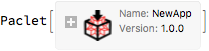
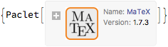
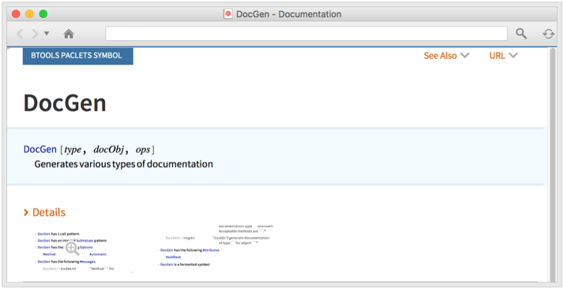
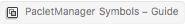
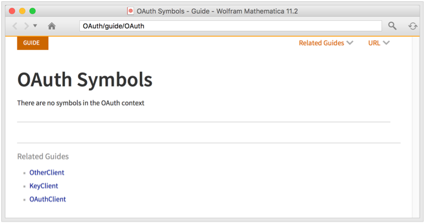
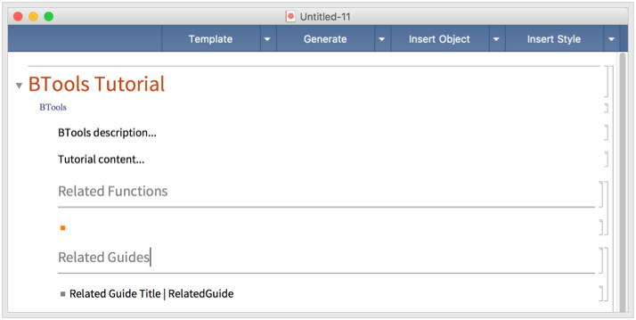
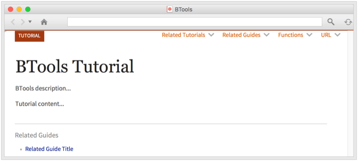

<a id="making-a-new-application" style="width:0;height:0;margin:0;padding:0;">&zwnj;</a>

## Making a new application

Load the package:

```mathematica
 <<BTools`Paclets`
```

Create a new application

```mathematica
 $AppDirectoryRoot = $TemporaryDirectory; 
 AppConfigure["NewApp"]
```

	(*Out:*)
	
	"/private/var/folders/9t/tqc70b7d61v753jkdbjkvd640000gp/T/Applications/NewApp"

Inspect what has been made in our new application:

```mathematica
 FileNameTake/@FileNames["*", AppDirectory["NewApp"]]
```

	(*Out:*)
	
	{"Config","Documentation","FrontEnd","Kernel","NewAppLoader.m","NewApp.wl","Packages","Private","project","Resources"}

```AppConfigure```  automatically builds out the basic directories used as well as a load-script to load the contents of the  ```"Packages"```  subdirectory with autoloading and other development support functionality.

Then we'll add a package

```mathematica
 AppAddContent["NewApp", FindFile["BTools`"]]
```

	(*Out:*)
	
	"/private/var/folders/9t/tqc70b7d61v753jkdbjkvd640000gp/T/Applications/NewApp/Packages/init.m"

And a stylesheet

```mathematica
 AppAddContent["NewApp", FEFindFileOnPath["BTools/CodePackage.nb", "StyleSheet"]]
```

	(*Out:*)
	
	"/private/var/folders/9t/tqc70b7d61v753jkdbjkvd640000gp/T/Applications/NewApp/FrontEnd/StyleSheets/CodePackage.nb"

Build the  ```"PacletInfo.m"```  file

```mathematica
 AppRegeneratePacletInfo["NewApp"]
```

	(*Out:*)
	
	"/private/var/folders/9t/tqc70b7d61v753jkdbjkvd640000gp/T/Applications/NewApp/PacletInfo.m"

And see what's inside:

```mathematica
 AppPacletInfo["NewApp"]
```

	(*Out:*)
	
	<|"Name"->"NewApp","Version"->"1.0.0","Extensions"-><|"Kernel"-><|"Root"->".","Context"->{"NewApp`"}|>,"FrontEnd"-><||>|>,"Location"->"/private/var/folders/9t/tqc70b7d61v753jkdbjkvd640000gp/T/Applications/NewApp"|>

We could then upload this application to the cloud so others can download it:

```mathematica
 AppPacletUpload["NewApp", CloudConnect->"b3m2a1.paclets@gmail.com"]
```

	(*Out:*)
	
	<|"PacletSiteFile"->CloudObject["http://www.wolframcloud.com/objects/b3m2a1.paclets/NewApp/PacletSite.mz",Permissions->"Public",Permissions->"Public"],"PacletFiles"->{CloudObject[["http://www.wolframcloud.com/objects/b3m2a1.paclets/NewApp/Paclets/NewApp-1.0.0.paclet"](http://www.wolframcloud.com/objects/b3m2a1.paclets/NewApp/Paclets/NewApp-1.0.0.paclet)]}|>

Someone could install the app like

```mathematica
 PacletInstall["NewApp",
 "Site"->"http://www.wolframcloud.com/objects/b3m2a1.paclets/NewApp"
 ]
```

	(*Out:*)
	


<a id="working-with-paclets" style="width:0;height:0;margin:0;padding:0;">&zwnj;</a>

## Working with Paclets

Install a paclet from GitHub

```mathematica
 PacletInstallPaclet@"github:szhorvat/MaTex"
```

	(*Out:*)
	


Find the names of all the paclets available on a server:

```mathematica
 PacletSiteInfoDataset[
 "https://www.wolframcloud.com/objects/b3m2a1.paclets/PacletServer"
 ]//
 Normal//
 Lookup[#,"Name"]&//
 DeleteDuplicates
```

	(*Out:*)
	
	{"BTools","ServiceConnection_DeckOfCards","ServiceConnection_NASA","ServiceConnection_StackExchange","ChemTools","ServiceConnection_WolframCommunity","SiteBuilder","PyTools","ServiceConnection_GitHub","PacKit","DocGen","OldHelpBrowser","CustomServiceConnection","CuratedData","ServiceConnection_GoogleDrive","ServiceConnection_Qwant","AmhCode","ObjectFramework","ServiceConnection_Git","ServiceConnection_GitHubJobs"}

Create a paclet directory from a package:

```mathematica
 pacDir=PacletAutoPaclet[$TemporaryDirectory, FindFile["FEInfoExtractor`"]]
```

	(*Out:*)
	
	"/private/var/folders/9t/tqc70b7d61v753jkdbjkvd640000gp/T/FEInfoExtractor"

Upload this paclet to the cloud

```mathematica
 PacletUpload[pacDir,
 "ServerName"->"TestPaclets",
  CloudConnect->"TestingAccount"
 ][["PacletFiles", 1]]
```

	(*Out:*)
	
	CloudObject[["http://www.wolframcloud.com/objects/b3m2a1.testing/TestPaclets/Paclets/FEInfoExtractor-1.0.0.paclet"](http://www.wolframcloud.com/objects/b3m2a1.testing/TestPaclets/Paclets/FEInfoExtractor-1.0.0.paclet)]

<a id="documentation-building" style="width:0;height:0;margin:0;padding:0;">&zwnj;</a>

## Documentation Building

Autogenerate documentation:

```mathematica
 DocGen[DocGen]
```



Autogenerate an overview guide for a context

```mathematica
 DocGen["Guide", "PacletManager`"]
```

	(*Out:*)
	
	NotebookObject[]

Autogenerate documentation paclets from a set of contexts:

```mathematica
 <<OAuth` 
 DocGen["Paclet", 
 {
  "OtherClient`",
  "KeyClient`",
  "OAuthClient`",
  "OAuth`"
  },
 Method->{
  Directory->$TemporaryDirectory
  }
 ]
```



Generate a template notebook for writing a tutorial



The  ```"SymbolPage"``` ,  ```"Guide"``` , and  ```"Tutorial"```  types support  ```"Template"``` ,  ```"Notebook"``` , and  ```"Save"```  methods.

We can write content in the template notebook and use the bar on the top to generate a tutorial.



<a id="frontend-resources" style="width:0;height:0;margin:0;padding:0;">&zwnj;</a>

## Front-End Resources

On the front-end side, the  [CodePackage](FrontEnd/StyleSheets/BTools/CodePackage.nb)  stylesheet provides a convenient stylesheet for developing packages. 

It provides a number of useful custom styles, customizable syntax coloring, block indentation, and package annotations in its  ```AutoGeneratedPackage``` .

You can see an example notebook  [here](Notebook-CodePackage.nb) .

There are two child stylesheets that remove a few functionalities of CodePackage, CodeNotebook, and CodePackagePlain. The first removes the  ```AutoGeneratedPackage``` , the second just removes the  ```DockedCells``` .

The  [DocGen](FrontEnd/StyleSheets/BTools/DocGen.nb)  stylesheet supports the DocGen package. It provides a toolbar for adding common templates, a hopefully simple-enough flow. Examples of a documentation template notebook can be found  [here](Notebook-DocGen.nb) .